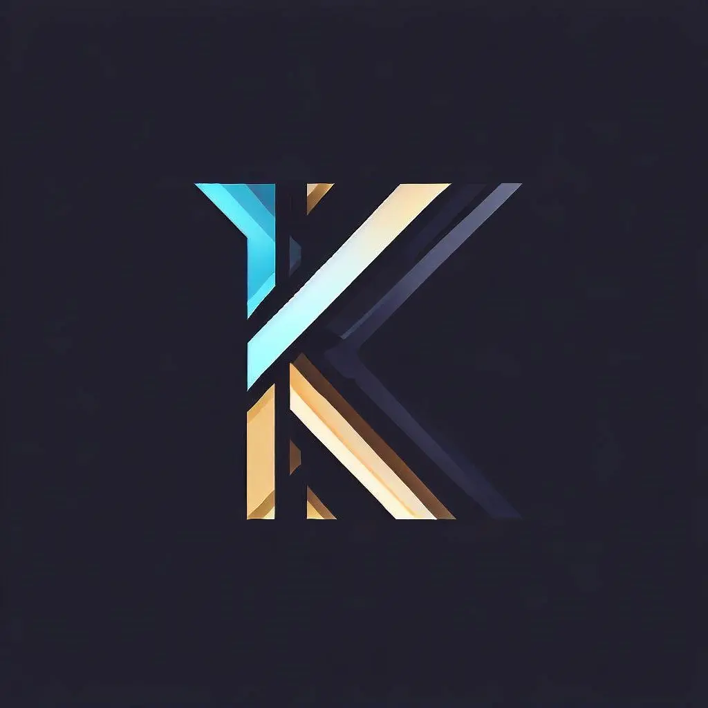

[![Contributors][contributors-shield]][contributors-url]
[![Forks][forks-shield]][forks-url]
[![Stargazers][stars-shield]][stars-url]
[![LinkedIn][linkedin-shield]][linkedin-url]
[![Issues][issues-shield]][issues-url]
[![Website][personal-shield]][personal-url]

<!-- [![MIT License][license-shield]][license-url] -->

<!-- PROJECT LOGO -->
 

  

  <h3 align="center">Kizzandev Website</h3>

  

    <!-- Example: An awesome README template to jumpstart your projects! -->
    My personal website! 🔥
     
    <a href="https://cv.kizzan.dev"><strong>Check it out »</strong></a>
     
     
    <a href="https://github.com/kizzandev/cv/issues/new?labels=bug&template=bug-report---.md">Report Bug</a>
    ·
    <a href="https://github.com/kizzandev/cv/issues/new?labels=enhancement&template=feature-request---.md">Request Feature</a>
  

<!-- TABLE OF CONTENTS -->

  
Table of Contents

  <ol>
    <li>
      <a href="#about-the-project">About The Project</a>
      <ul>
        <li><a href="#built-with">Built With</a></li>
      </ul>
    </li>
    <li>
      <a href="#getting-started">Getting Started</a>
      <ul>
        <li><a href="#prerequisites">Prerequisites</a></li>
        <li><a href="#installation">Installation</a></li>
      </ul>
    </li>
    <li><a href="#usage">Usage</a></li>
    <li><a href="#roadmap">Roadmap</a></li>
    <li><a href="#contributing">Contributing</a></li>
    <li><a href="#license">License</a></li>
    <li><a href="#contact">Contact</a></li>
    <li><a href="#acknowledgments">Acknowledgments</a></li>
  </ol>

<!-- ABOUT THE PROJECT -->

## About The Project

[![Product Name Screen Shot][product-screenshot]][personal-url]

My personal website. I am trying a new design and I hope you like it.

(<a href="#readme-top">back to top</a>)

### Built With

[![Vite][Vite]][Vite-url]
[![TypeScript][TypeScript]][TypeScript-url]
[![React][React.js]][React-url]
[![Tailwind][TailwindCSS]][Tailwind-url]

(<a href="#readme-top">back to top</a>)

<!-- ROADMAP -->

## Roadmap

- [x] Multi-language Support
  - [x] Spanish (AR)
  - [x] English
- [ ] Language dropdown
- [ ] Bento changes
  - [ ] Componentize elements in code
  - [ ] Add interactivity
  - [ ] Add link to blog in "Latest Article"
  - [ ] Add a capstone project
- [ ] Change the _Now: job title_ section to something else
  - Options:
    - [ ] Keep it as _Now: job title_
    - [ ] Next live presentation: _Next on: [NAME OF THE EVENT]\(link)_
    - [ ] Side job as in _Side job: [NAME OF THE JOB]\(link)_
      - e.g. John Smith: on [Your new favorite tv show]\(link)
    - [ ] YouTube Channel

See the [open issues](https://github.com/kizzandev/cv/issues) for a full list of proposed features (and known issues).

(<a href="#readme-top">back to top</a>)

<!-- ACKNOWLEDGMENTS -->

## Acknowledgments

- [Best-README-Template][md-style-credit]: This README is based on the Best-README-Template by othneildrew

(<a href="#readme-top">back to top</a>)

<!-- MARKDOWN LINKS & IMAGES -->
<!-- https://www.markdownguide.org/basic-syntax/#reference-style-links -->

[contributors-shield]: https://img.shields.io/github/contributors/kizzandev/cv.svg?style=for-the-badge
[contributors-url]: https://github.com/kizzandev/cv/graphs/contributors
[forks-shield]: https://img.shields.io/github/forks/kizzandev/cv.svg?style=for-the-badge
[forks-url]: https://github.com/kizzandev/cv/network/members
[stars-shield]: https://img.shields.io/github/stars/kizzandev/cv.svg?style=for-the-badge
[stars-url]: https://github.com/kizzandev/cv/stargazers
[issues-shield]: https://img.shields.io/github/issues/kizzandev/cv.svg?style=for-the-badge
[issues-url]: https://github.com/kizzandev/cv/issues
[license-shield]: https://img.shields.io/github/license/kizzandev/cv.svg?style=for-the-badge
[license-url]: https://github.com/kizzandev/cv/blob/master/LICENSE.txt
[linkedin-shield]: https://img.shields.io/badge/-LinkedIn-black.svg?style=for-the-badge&logo=linkedin&colorB=555
[linkedin-url]: https://linkedin.com/in/kevinzanzi
[personal-shield]: https://img.shields.io/badge/-Personal_Website-black.svg?style=for-the-badge&logo=superuser&colorB=555
[personal-url]: https://cv.kizzan.dev
[product-screenshot]: cv.kizzan.dev_ss.png
[Vite]: https://img.shields.io/badge/Vite-20232A?style=for-the-badge&logo=vite
[Vite-url]: https://vitejs.dev/
[TypeScript]: https://img.shields.io/badge/TypeScript-20232A?style=for-the-badge&logo=typescript
[TypeScript-url]: https://www.typescriptlang.org/
[React.js]: https://img.shields.io/badge/React-20232A?style=for-the-badge&logo=react
[React-url]: https://reactjs.org/
[TailwindCSS]: https://img.shields.io/badge/Tailwind_CSS-20232A?style=for-the-badge&logo=tailwindcss
[Tailwind-url]: https://tailwindcss.com/
[md-style-credit]: https://github.com/othneildrew/Best-README-Template
